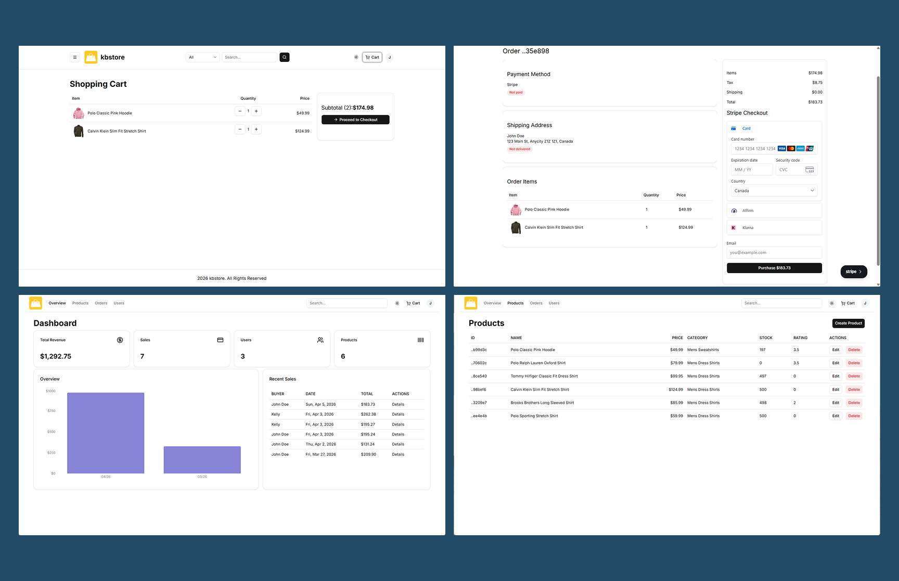
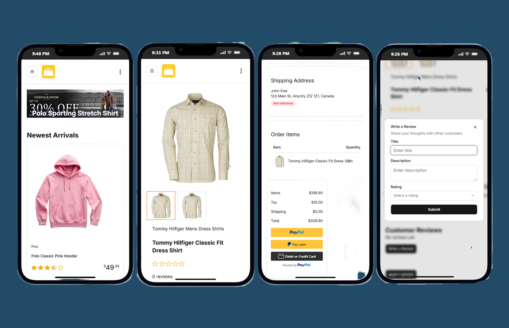

# KBStore – Next.js E-commerce Web App
**KBStore** is a full-stack e-commerce web application built with modern Next.js App Router architecture.

It includes authentication, admin dashboard, product management, order processing, and multiple payment integrations.

The project demonstrates end-to-end application development, including database design, secure authentication, server actions, and production deployment.
<br />

### Screenshots
  
  
  
<br />


### 🌐 Live Demo
https://kbstore.kellybytes.dev
<br />

---

## Table of Contents
- [Features](#-features)
- [Tech Stack](#-tech-stack)
- [Architecture Overview](#-architecture-overview)
- [Key Learning Highlights](#-key-learning-highlights)
- [Installation](#-installation-local-development)
- [Environment Variables](#-environment-variables)
- [File Structure](#-file-structure)
- [Authentication & Access Control](#-authentication--access-control)
- [Payments](#-payments)
- [Testing](#-testing)
- [Deployment](#-deployment)
- [License](#-license)
<br />

## 🧩 Features
### User Features
- Authentication with NextAuth
- User profile & order history
- Interactive multi-step checkout
- Ratings & reviews system
- Search, filtering, sorting & pagination
- Featured products & banners
- Dark / Light mode
- Multiple product images upload

### Admin Features
- Admin dashboard with analytics charts
- Product CRUD management
- Order management
- User management
- Admin search functionality
- Sales overview statistics

### Payments
- Stripe integration
- PayPal integration
- Cash on delivery option
- Webhook handling for payment confirmation

### Additional
- Responsive UI
- Server Actions with App Router
- Email receipts
- Image uploads using Uploadthing
- Pagination & reusable UI components
<br />

## 🛠 Tech Stack
### Frontend
- Next.js (App Router)
- React
- TypeScript
- Tailwind CSS
- shadcn/ui
- Recharts

### Backend / Full-Stack
- Next.js Server Actions
- NextAuth
- Prisma ORM
- PostgreSQL (Neon)
- Zod validation

### Payments & Services
- Stripe API
- PayPal API
- Uploadthing
- Resend / React Email

### Testing & Tooling
- Jest
- ESLint
- TypeScript

### Deployment
- Vercel
<br />

## 🏗 Architecture Overview
The application follows a modular full-stack architecture using Next.js App Router:

Client Components → Server Actions → Prisma ORM → PostgreSQL
↓
Auth / Payments / Upload APIs

Key architectural decisions:

- App Router for route grouping and layouts
- Server Actions for data mutations
- Prisma for type-safe database access
- Auth guards for protected routes
- Reusable UI components for scalability
<br />

## 💡 Key Learning Highlights
This project focuses on building a production-style e-commerce system with modern full-stack patterns:

- Implementing authentication using NextAuth with Prisma adapter
- Designing relational database schema for users, products, orders, and reviews
- Handling secure payments with Stripe and PayPal
- Using Next.js Server Actions for CRUD operations
- Building admin dashboard with analytics charts
- Managing role-based access control (admin vs user)
- Creating reusable component architecture
- Handling file uploads and image management
- Implementing search, filtering, and pagination
- Managing webhook events for payment confirmation
- Deploying full-stack Next.js application to production
<br />

## ⚡ Installation (Local Development)
```bash
# Clone repository
git clone https://github.com/yourusername/kbstore.git

cd kbstore

# Install dependencies
npm install

# Run development server
npm run dev
```
<br />

## 🌿 Environment Variables
Create a `.env` file in the root directory:

```bash
DATABASE_URL=
NEXTAUTH_SECRET=
NEXTAUTH_URL=

STRIPE_SECRET_KEY=
STRIPE_PUBLISHABLE_KEY=
STRIPE_WEBHOOK_SECRET=

PAYPAL_CLIENT_ID=
PAYPAL_SECRET=

UPLOADTHING_SECRET=
UPLOADTHING_APP_ID=

RESEND_API_KEY=
```
<br />

## 📁 File Structure
```
app
├── (auth)        # Authentication routes
├── (root)        # Storefront pages
├── admin         # Admin dashboard
├── user          # User dashboard
├── api           # API routes & webhooks
components        # Reusable UI components
lib               # Server actions & utilities
prisma            # Database schema & migrations
db                # Seed data
email             # Email templates
tests             # Jest tests
```
<br />

## 🔐 Authentication & Access Control
- NextAuth authentication
- Prisma adapter for session storage
- Protected admin routes
- Role-based access (admin vs user)
- Server-side auth guards
<br />

## 💳 Payments
This application supports multiple payment methods:

- Stripe Checkout
- PayPal Smart Buttons
- Cash on Delivery

Stripe webhook is used to confirm payment status and update orders.
<br />

## 🧪 Testing
Run tests:

```bash
npm test
```
Example:
```
PASS tests/paypal.test.ts
```
<br />

## 🚀 Deployment
The application is deployed on Vercel.

Production build:
```bash
npm run build
npm start
```
<br />

## 📄 License
MIT License

---
[Back to Top](#kbstore--nextjs-e-commerce-web-app)
